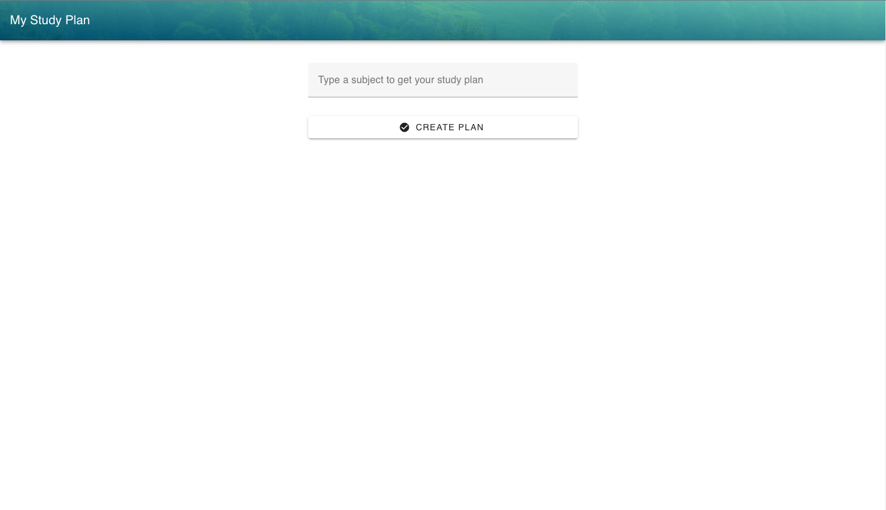
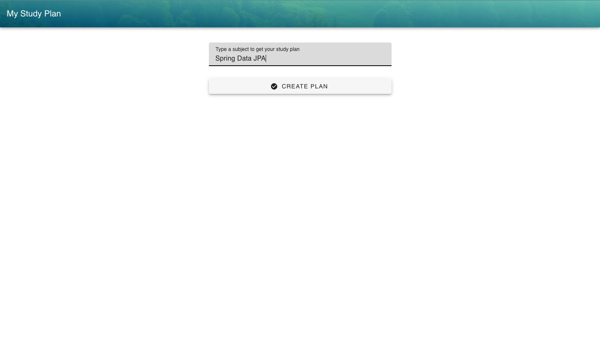
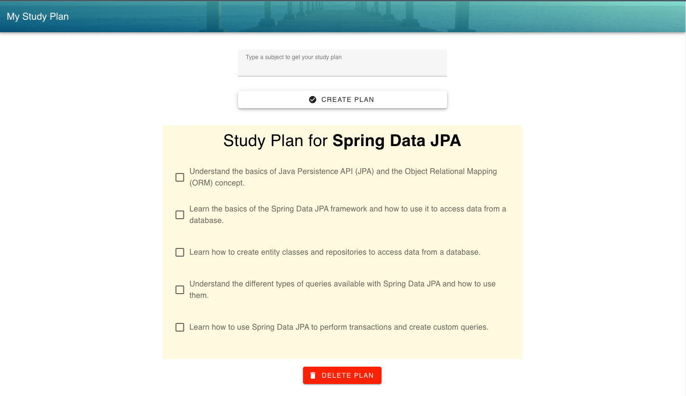
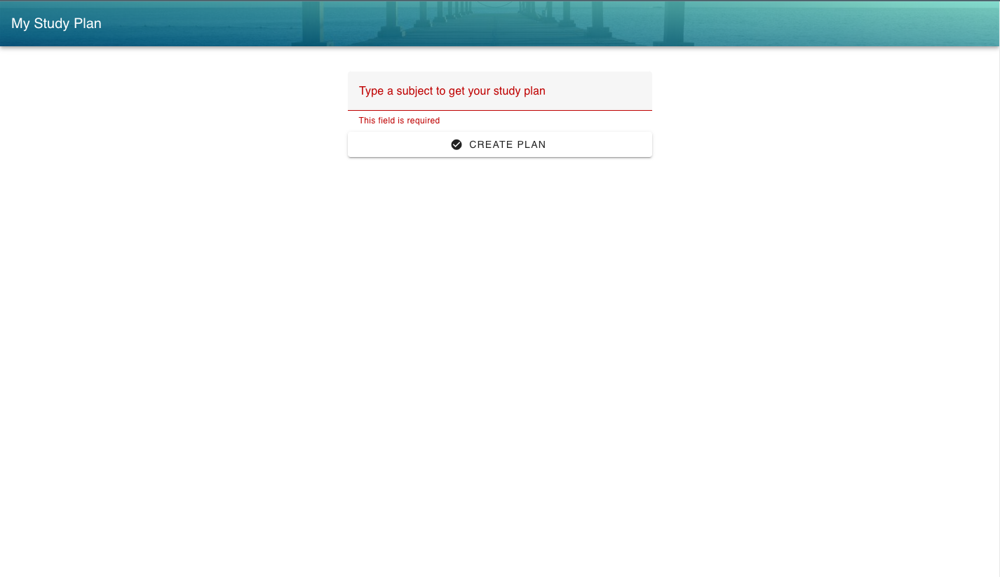

<h1 align="center"> Study Plan Generator Vue.js UI </h1>

<p align="center">
UI to integrate with the Study Plan Generator API <br/>
</p>

<p align="center">
  <a href="#-setup">Setup</a>&nbsp;&nbsp;&nbsp;|&nbsp;&nbsp;&nbsp;
  <a href="#-technologies">Technologies</a>&nbsp;&nbsp;&nbsp;|&nbsp;&nbsp;&nbsp;
  <a href="#-project">Project</a>&nbsp;&nbsp;&nbsp;|&nbsp;&nbsp;&nbsp;
  <a href="#memo-licença">License</a>
</p>

<p align="center">
  
</p>

<br>

> Note! This project is a working in progress

<br>

## 🚧 Setup

### Project setup

<br>

> Note! After clone the project and before run it, make sure to run the API for where this UI will fetch data. You can use the one I built [here](https://github.com/RaquelMichelon/study-plan-generator-api). To request the data successfully, you maybe will have to change the url requested inside the createPlan method in the App.vue file.

<br>


```
yarn install
```

#### Compiles and hot-reloads for development

```
yarn serve
```

#### Compiles and minifies for production

```
yarn build
```

#### Lints and fixes files

```
yarn lint
```

#### Customize configuration

See [Configuration Reference](https://cli.vuejs.org/config/).

## 🚀 Technologies

- Vue.js 3
- Vuetify 3

## 💻 Project

This is an UI developed in Vue.js to integrate with an API to create personalized study plan based on a given subject. The API can be found [here](https://github.com/RaquelMichelon/study-plan-generator-api).

### Screenshots









## :memo: Licença

This project has the MIT license.

---

⌨️ Developed by [Raquel Michelon](https://github.com/RaquelMichelon)
